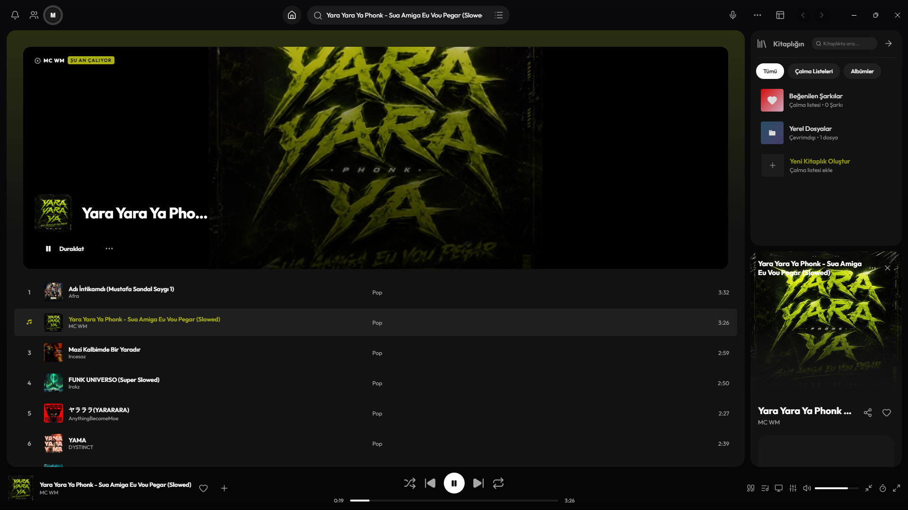

<p align="center">
  
</p>

<h1 align="center">Unia</h1>

<p align="center">
  <strong>Unia Desktop Music Player</strong> — A modern, sleek, and premium desktop music player featuring Deezer and YouTube integrations, Discord Rich Presence (RPC), and an advanced audio equalizer.
</p>

---

## 🚀 Features

- **🎵 YouTube & Deezer Integration**: Search tracks via Deezer API and stream high-quality audio seamlessly through YouTube using intelligent video resolution.
- **💾 Automatic Offline Caching**: The top 10 most recently played tracks are automatically cached to `.cache/` as MP3s in the background. When played again or offline, they load instantly from the local disk.
- **🎛️ 5-Band Audio Equalizer (EQ)**: Customize frequency bands to match your music taste. Includes built-in presets: *Bass Booster, Vocal Booster, Pop, and Electronic* (available for offline/local files).
- **🎮 Discord Rich Presence (RPC)**: Show off what you're listening to, including track name, artist, album art, and current progress, directly on your Discord profile.
- **🎨 Dynamic Layout System**: Change layouts in real-time to match your style:
  - Standard Layout
  - Mirrored Layout
  - Side-by-Side (Left & Right)
  - Compact Minimalist
  - Cinematic Widescreen
- **🎨 Smart Color Extraction**: Automatically extracts the dominant colors from the current album art to dynamically style the interface theme.
- **⏰ Sleep Timer**: Set a timer to automatically pause playback at the end of the song or after a custom duration (5m, 15m, 30m, 1h).
- **📂 Local File Support**: Load local MP3 files into your library and play them with equalizer support.

---

## 🛠️ Installation & Running

Follow these steps to get the project running locally:

### Prerequisites
- [Node.js](https://nodejs.org/) (v16 or higher recommended)
- [Git](https://git-scm.com/)

### Steps

1. **Clone the Repository**:
   ```bash
   git clone https://github.com/xenpian/unia.git
   cd unia
   ```

2. **Install Dependencies**:
   ```bash
   npm install
   ```

3. **Start the Application**:
   ```bash
   npm start
   ```
   *This starts the Electron window and spins up the local API server on port 3000.*

---

## 📂 Project Structure

```text
unia/
├── android/            # Android native mobile application code
├── js/                 # Application modules
│   ├── player.js       # Playback core, streaming, and EQ controls
│   ├── state.js        # Global state and settings storage
│   ├── theme.js        # Dynamic theme styling engine
│   └── ui-renderers.js # Slider, home grids, and profile renderers
├── logo/               # Application assets (unia.ico, unia.png)
├── pages/              # HTML layout templates (home, playlist, profile, shazam)
├── src/
│   └── api-router.js   # Local server router handling cache and streams
├── db.js               # JSON database manager (unia_local_db.json)
├── main.js             # Electron main process entry point
├── preload.js          # Secure Electron IPC communication bridge
└── renderer.js         # App orchestrator and frontend event handlers
```

---

## 📝 Contributing

1. Fork the project.
2. Create a feature branch: `git checkout -b feature/my-new-feature`.
3. Commit your changes: `git commit -m 'feat: Add some feature'`.
4. Push to the branch: `git push origin feature/my-new-feature`.
5. Open a Pull Request.

---

## 📄 License
This project is licensed under the **MIT License**.
